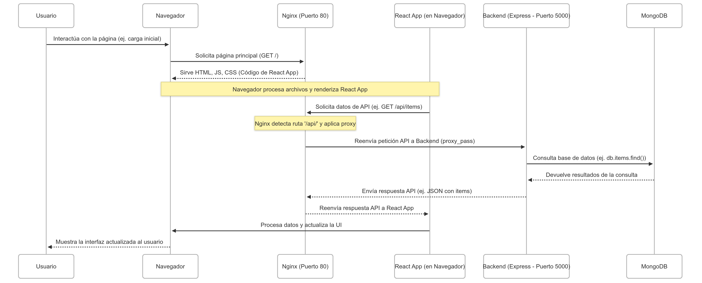

# Implementación de Pipeline DevOps para Aplicación Web Simple

[](https://github.com/JoanProjects/taller-devops-final/actions/workflows/ci-cd.yml)

**Proyecto:** Taller Final DevOps
**Curso:** Electiva 1
**Fecha:** 20/4/2025

## Equipo

*   [Joan Arroyo]

## 1. Resumen del Proyecto

Este proyecto consiste en el diseño, implementación y documentación de un pipeline DevOps completo para una aplicación web MERN (MongoDB, Express, React, Node.js) simple. Se aplicaron de manera práctica los conceptos de control de versiones (Git/GitHub), contenerización (Docker), orquestación local (Docker Compose), pruebas automatizadas (Jest, RTL, Supertest, ESLint), integración y despliegue continuo (CI/CD con GitHub Actions), y monitoreo básico, cubriendo el ciclo de vida DevOps aprendido en el curso.

## 2. Arquitectura

La aplicación sigue una arquitectura simple de microservicios contenerizados, como se muestra en el siguiente diagrama:



**Componentes Principales:**

*   **Frontend:** Aplicación de página única (SPA) desarrollada con **React (usando Vite)**. Responsable de la interfaz y la interacción con el usuario.
*   **Servidor Web/Proxy:** **Nginx** actúa como servidor para los archivos estáticos del frontend y como **Reverse Proxy** para redirigir las llamadas a la API (`/api/*`) al servicio backend.
*   **Backend:** API RESTful desarrollada con **Node.js** y el framework **Express**. Gestiona la lógica de negocio y la comunicación con la base de datos.
*   **Base de Datos:** Base de datos NoSQL **MongoDB** utilizada para persistir los datos de la aplicación.

## 3. Tecnologías Utilizadas

*   **Frontend:** React (Vite), JavaScript, CSS
*   **Backend:** Node.js, Express.js
*   **Base de Datos:** MongoDB
*   **Servidor Web/Proxy:** Nginx
*   **Contenerización:** Docker
*   **Orquestación Local:** Docker Compose
*   **CI/CD:** GitHub Actions
*   **Control de Versiones:** Git, GitHub
*   **Pruebas:** ESLint, Jest, React Testing Library (Frontend), Supertest (Backend)
*   **Registro de Contenedores:** Docker Hub

## 4. Entorno de Desarrollo Local

Levanta la aplicación completa localmente usando Docker Compose.

**Prerrequisitos:**
*   Git
*   Docker Engine
*   Docker Compose (v1 o v2)

**Pasos:**

1.  **Clonar:**
    ```bash
    git clone https://github.com/JoanProjects/taller-devops-final.git
    cd taller-devops-final
    ```

2.  **Construir y Ejecutar:**
    ```bash
    # Construye las imágenes Docker definidas en los Dockerfiles
    docker-compose build

    # Inicia los contenedores (frontend, backend, mongo) en segundo plano
    docker-compose up -d
    ```

3.  **Acceder:**
    *   Abre tu navegador en `http://localhost`

4.  **Verificar:**
    *   Estado: `docker-compose ps`
    *   Logs Backend: `docker-compose logs -f backend`
    *   Logs Frontend (Nginx): `docker-compose logs -f frontend`
    *   Logs Base de Datos: `docker-compose logs -f mongo`

5.  **Detener:**
    ```bash
    docker-compose down
    # Para borrar también el volumen de datos de MongoDB:
    # docker-compose down -v
    ```

## 5. Pruebas Automatizadas

El proyecto incluye pruebas para asegurar la calidad del código:

*   **Linting (ESLint):** Verifica el estilo y errores potenciales en el código JS/JSX.
    ```bash
    # Ejecutar desde la raíz del proyecto
    (cd backend && npm run lint)
    (cd frontend && npm run lint)
    ```
*   **Pruebas Unitarias/Integración (Jest):**
    *   **Frontend:** Pruebas de componentes React con React Testing Library.
    *   **Backend:** Pruebas de endpoints API con Supertest.
    ```bash
    # Instalar dependencias de desarrollo si no lo has hecho
    # (cd backend && npm install)
    # (cd frontend && npm install)

    # Ejecutar pruebas desde la raíz del proyecto
    (cd backend && npm test)
    (cd frontend && npm test)
    ```
    *(Nota: Estas pruebas se ejecutan automáticamente en el pipeline CI/CD)*

## 6. Pipeline CI/CD (GitHub Actions)

El workflow definido en `.github/workflows/ci-cd.yml` automatiza el proceso:

*   **Disparadores:** `push` a `main` y `pull_request` a `main`.
*   **Etapas (Jobs):**
    1.  `lint`: Ejecuta linters.
    2.  `test`: Ejecuta pruebas unitarias y de integración (con un servicio MongoDB temporal).
    3.  `build-and-push`: (Solo en `push` a `main`) Construye y sube imágenes Docker (`backend`, `frontend`) a Docker Hub.
    4.  `deploy`: (Solo en `push` a `main`) Se conecta vía SSH al servidor, descarga las imágenes nuevas y reinicia los servicios con `docker-compose`.
*   **Estado:** [](https://github.com/JoanProjects/taller-devops-final/actions/workflows/ci-cd.yml)

*   **Secretos Requeridos en GitHub Actions:**
    *   `DOCKERHUB_USERNAME`: Usuario de Docker Hub.
    *   `DOCKERHUB_TOKEN`: Token de Acceso de Docker Hub.
    *   `SSH_HOST`: IP o DNS del servidor de despliegue.
    *   `SSH_USER`: Usuario SSH del servidor.
    *   `SSH_PRIVATE_KEY`: Clave SSH privada para la conexión.

## 7. Despliegue

El despliegue al servidor de producción/staging se realiza automáticamente al hacer merge o push a la rama `main`.

## 8. Monitoreo Básico

*   **Logs:** Disponibles vía `docker-compose logs <servicio>` en el servidor.
*   **Health Check:** Endpoint `/api/health` en el backend para verificar su estado.

## 9. Desafíos y Aprendizajes

*   **Desafíos Clave:** Configuración de Nginx como proxy, sincronización de `package-lock.json` para `npm ci`, depuración de scripts de CI/CD, gestión segura de secretos SSH y Docker Hub.
*   **Aprendizajes Principales:** Valor de Docker y Compose para consistencia, eficiencia de la automatización CI/CD, importancia de las pruebas multinivel, flujo práctico DevOps, consideraciones de seguridad.

## 10. Mejoras Futuras

*   Implementar pruebas End-to-End (Cypress/Playwright).
*   Integrar monitoreo avanzado (Prometheus/Grafana/Loki).
*   Configurar HTTPS (Let's Encrypt).
*   Optimizar imágenes Docker (multi-stage, capas).
*   Gestionar infraestructura con IaC (Terraform).
*   Implementar estrategias de despliegue avanzadas (Blue/Green).

---
